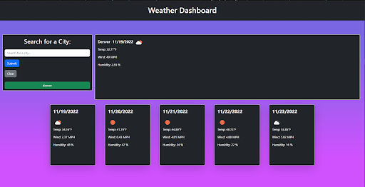

# weather-dashboard

## Description

This project is a weather dashboard that displays the current and the next five day forecasts. It utilizes the Open Weather api to display the date, weather icon, temperature, wind speeds, and humidity.

## Deployment Link

- [Weather Dashboard](https://t3mpz.github.io/weather-dashboard/)

## Screenshot

## Installation

## Usage

## Credits

## License
